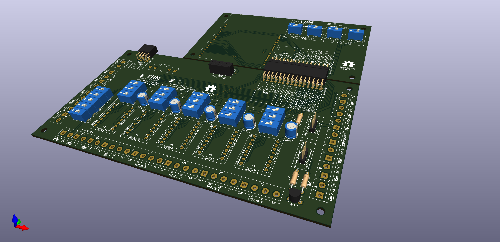
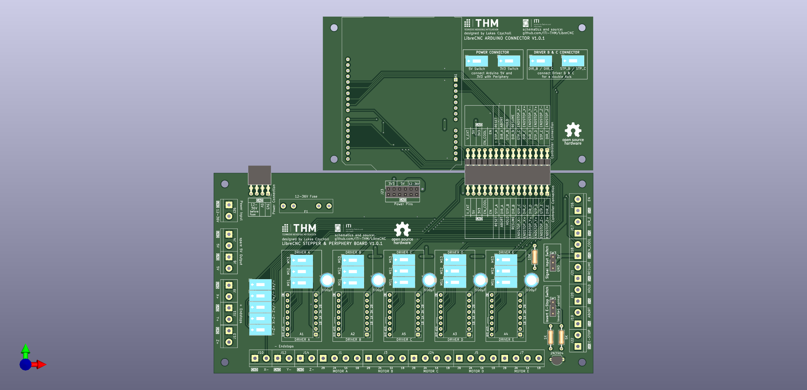

# LibreCNC

## Introduction

LibreCNC is a 100% open source circuit board repository for stepper driver powered CNC Machines of any kind. The circuit boards are designed to be modular with documented interfaces in between the boards.

## Circuit Boards

The main modular circuit board is seperated in 3 parts:
- a [periphery board](#periphery-board) for stepper drivers, endstops and buttons
- a [logic board](#logic-board) for a (micro)controller
- a [power board](#power-board) for a stable power supply (tbd)

These parts have fixed interfaces that might be altered whenever a main version is changed (eg. from V1.x to V2.x).

### periphery board

current variations:
- [periphery_5_drivers](./periphery_5_drivers/README.md)

### logic board

current variations:
- [arduino-uno-connector](./arduino-uno-connector/README.md)

### power board

current variations:
None

Additionally these boards were created for specific tasks:
- [arduino pwm fan control board](./fan-control/README.md)

## Repository Structure

Each Circuit Board is designed with [KiCad](https://www.kicad.org/). 

The boards are stored within a directory with the corrsponding name.

Each directory consists of:
- a project file (.kicad_pro)
- a schematic file (.kicad_sch)
- a pcb file (.kicad_pcb)
- a gerber file directory storing gerber files of the finished versions
- a readme giving details about the board
- a picture of a 3D View of the board
- OPTIONAL: a list of parts

## Licencing 

All Circuit Boards are Licenced with the MIT Licence. Feel free to fork and experiment with the schematics and pcbs as you want.