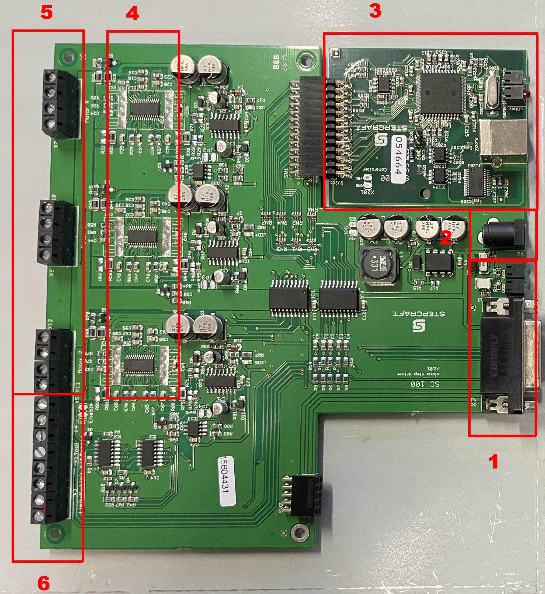
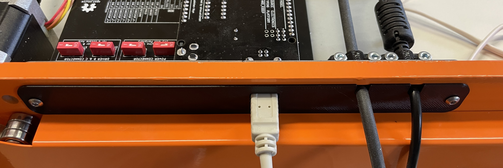

# Stepcraft 840 V1 Success Story
**Replacing the original Board with an OpenSource**

- [Stepcraft 840 V1 Success Story](#stepcraft-840-v1-success-story)
  - [disclaimer](#disclaimer)
  - [Introduction](#introduction)
  - [the default board](#the-default-board)
  - [setting up the libreCNC Board with an arduino UNO](#setting-up-the-librecnc-board-with-an-arduino-uno)
    - [getting everything together](#getting-everything-together)
    - [setting up the board](#setting-up-the-board)
    - [exchanging with the libreCNC Board](#exchanging-with-the-librecnc-board)
  - [setting up the software](#setting-up-the-software)
  - [Conclusion](#conclusion)
  - [Optional: Cover](#optional-cover)
  - [Optional: Fans](#optional-fans)


## disclaimer
altering the Stepcraft 840 with this guide is your responsibility. Please take care of all necessary safety measures and be aware that I as the writer take no responsibility for your health or the health of the machine. Please be aware that your own thinking and basic knowledge and understanding is needed for this guide to be successfull. 

Please also open an issue if you are stuck on any part of this guide or if you were misguided. Thank you for your participation.

## Introduction

The Stepcraft 840 is a hobby milling machine featuring 3 Axis driven by Stepper Drivers, Endstops and (optional) a milling head or any tool. It basically has the same default setup as a 3D Printer.

Currently the Stepcraft 840 is only avaliable in a second revision as the first one had several issues. 
But both versions lack the features of an open source project and thats what this story is changing.

## the default board



When ordering a Stepcraft 840, it ships with a commercial board to control the machine. The board features the following things:

1. RS232 connection for direct communication
2. 12V Barrel Jack Port
3. (optional) USB B Port for indirect communication. (only works with specific software)
4. soldered in stepper drivers
5. 3 stepper driver connections for each axis
6. endstop connections

The board is designed to work with specific proprietary control software which renders the whole board useless if the software is not avaliable or does not satisfy the needs of the user.

## setting up the libreCNC Board with an arduino UNO

### getting everything together
You need the [periphery 5 drivers](../../periphery_5_drivers/README.md) and the [arduino uno connector](../../arduino-uno-connector/README.md) board.

You also need 3 (4 with dual y Axis) stepper drivers. Prefereed are [TMC2208](https://github.com/bigtreetech/BIGTREETECH-TMC2208-V3.0), but any driver with the same basic behavior as the [A4988](https://www.pololu.com/product/1182) works.

With this setup you also need an [Arduino Uno](https://store.arduino.cc/products/arduino-uno-rev3).

### setting up the board

Connect the Arduino Uno with the Arduino Uno Board. You need to enable the Power Connection 5V Switch as this setup only provides the main voltage (12-36V) to the drivers and needs the 5V logical voltage from the arduino.

Then insert the stepper drivers into a, b and c (and d with dual Y Axis) into the slots.

### exchanging with the libreCNC Board

The libreCNC Board Version 1.0.1 is specifically designed to fit within the same slot as the commercial stepcraft board.
It also features almost all peripherals as the commcercial alternative. 


This is how you can connect everything:

* place any non electrically conductive material like a tape on the inside of the metal cover hiding the circuit board within the stepcraft 840.
* 1,2,3: connect the stepper motors from stepcraft x,y,z to libreCNC a,b,d. (if your stepcraft has to y motors, connect the second one to c)
* 4: connect the y endstop connection into y- and the x endstop connection into x-. Also switch the x-/z- switch if no specific cable for the z endstop is avaliable. This means the x and z endstop are connected to the same cable within the milling machine.
* 5: The current libreCNC setup does not provide a Barrel Jack. So instead you need to connect the main Power with screw connectors 

**WARNING: USE AN ELECTRICALLY CONDUCTIVE MATERIAL ON THE INSIDE OF THE METAL COVER**

## setting up the software

With this setup it is preferred to use [grbl](https://github.com/gnea/grbl) to control the machine.

Please use the latest [tutorial](https://github.com/gnea/grbl/wiki/Compiling-Grbl) to set up grbl on the arduino uno.

Optional: 
If you prefer to have a machine that works within a positive coordinate system, you need to change the [config.h](https://github.com/gnea/grbl/blob/master/grbl/config.h) of the grbl software. Make sure to find this part of the config.h:
```
// After homing, Grbl will set by default the entire machine space into negative space, as is typical
// for professional CNC machines, regardless of where the limit switches are located. Uncomment this
// define to force Grbl to always set the machine origin at the homed location despite switch orientation.
#define HOMING_FORCE_SET_ORIGIN // Uncomment to enable.
```

After setting up grbl you need to adjust the grbl configuration by using any serial connection. I prefer using the [Universal G Code Sender](https://github.com/winder/Universal-G-Code-Sender) when using grbl.

This is how the grbl configuration looks like for the setup with the stepcraft 840:
```
$0 = 10    (Step pulse time, microseconds)
$1 = 25    (Step idle delay, milliseconds)
$2 = 0    (Step pulse invert, mask)
$3 = 0    (Step direction invert, mask)
$4 = 0    (Invert step enable pin, boolean)
$5 = 1    (Invert limit pins, boolean)
$6 = 0    (Invert probe pin, boolean)
$10 = 1    (Status report options, mask)
$11 = 0.010    (Junction deviation, millimeters)
$12 = 0.002    (Arc tolerance, millimeters)
$13 = 0    (Report in inches, boolean)
$20 = 0    (Soft limits enable, boolean)
$21 = 0    (Hard limits enable, boolean)
$22 = 1    (Homing cycle enable, boolean)
$23 = 7    (Homing direction invert, mask)
$24 = 250.000    (Homing locate feed rate, mm/min)
$25 = 1000.000    (Homing search seek rate, mm/min)
$26 = 50    (Homing switch debounce delay, milliseconds)
$27 = 1.000    (Homing switch pull-off distance, millimeters)
$30 = 1000    (Maximum spindle speed, RPM)
$31 = 0    (Minimum spindle speed, RPM)
$32 = 0    (Laser-mode enable, boolean)
$100 = 530.000    (X-axis travel resolution, step/mm)
$101 = 530.000    (Y-axis travel resolution, step/mm)
$102 = 530.000    (Z-axis travel resolution, step/mm)
$110 = 1000.000    (X-axis maximum rate, mm/min)
$111 = 1000.000    (Y-axis maximum rate, mm/min)
$112 = 800.000    (Z-axis maximum rate, mm/min)
$120 = 25.000    (X-axis acceleration, mm/sec^2)
$121 = 25.000    (Y-axis acceleration, mm/sec^2)
$122 = 25.000    (Z-axis acceleration, mm/sec^2)
$130 = 600.000    (X-axis maximum travel, millimeters)
$131 = 840.000    (Y-axis maximum travel, millimeters)
$132 = 135.000    (Z-axis maximum travel, millimeters)
```
**WARNING: When wanting to use the machine in negative space make sure $5 and $23 are set to your needs**

## Conclusion

If you reached this point: Congratulations! You made your Stepcraft Open Source. Taste The Freedom of Choice regarding Software. Feel free to adjust the Boards to your needs.

There are a few optional Steps you can do to make your Stepcraft even better

## Optional: Cover



There are several Covers avaliable within the [cover folder](./Covers/).

You can choose between 3mf files for printing or a 3fd file for altering with fusion360.

You can also find pictures of the different covers within the folder.

## Optional: Fans


To make sure the stepper drivers are not getting overheated you can use two fans. You can connect the fans to the 5V or 12V output of the periphery board.

To use this fan setup, use the files within the [fan socket](./FanSocket/) folder.