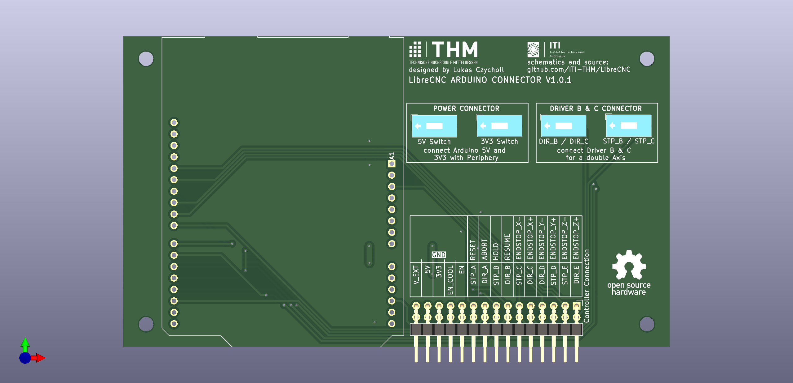

# Arduino Connector

This board is connecting an arduino uno with the periphery board. 
It is designed to be used with [grbl](https://github.com/gnea/grbl) as running software.
Therefore the grbl pinouts are used.

## Driver Usage

- Driver A: X Axis
- Driver B: Y Axis (can be extended with Driver C for a Dual Axis)
- Driver D: Z Axis
- Driver E: Spindle

## Additional Infos

Please be aware of the following things:

- as long as the periphery board has no 5V or 3V3 Input, the 5V and 3V3 of the Arduino can be used.
- the board is designed in a way that the usb port is avaliable at the top of the board. If mounting within limited space be aware that the USB Port is outside the board size.