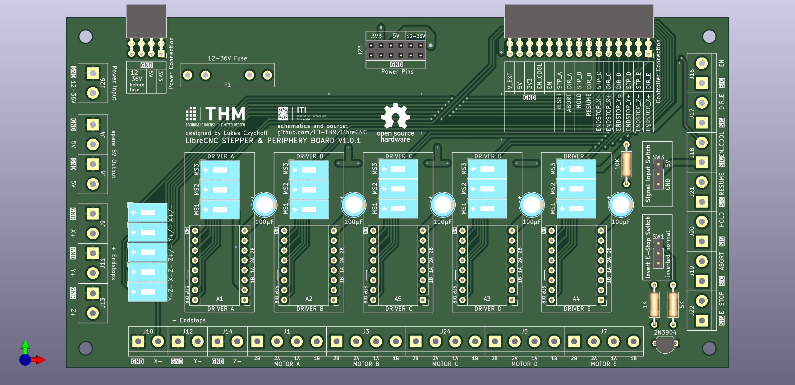

# Periphery 5 Drivers

This board is holding periphery for the following:
- 5 stepper drivers
- 6 Endstops
- 5 Buttons
- signal forwarding
- power connections

## stepper drivers

The board is designed for A4988 drivers. 
Therefore any compatabile driver (like the TMC2209) can be used with this board.

## Endstops

the following (basic) endstops are supported:
- X+
- X-
- Y+
- Y-
- Z+
- Z-

Additionally there are switches to connect several endstops in order to be more compatible with different controllers.

- Y- to Z- and X- to Z- can be connected (as it is needed for specific machines)
- X-,Y- & Z- can be connected to the + part to use only one logic signal for both endstops

## Buttons

these buttons are supported:
- E-Stop
- Abort
- Hold
- Resume

The E-Stop signal can be inverted with a hardware switch.

To connect different buttons the signal can be connected to either 5V or GND

## Signal Forwarding

the following signals can be used by external periphery:
- EN
- DIR_E (eg. for an external Spindle)
- EN_COOL (eg. for an external Spindle)

## power connections

### Input: 
When using the periphery board without a power board, the power input screw connection can be used.
This input (as well as the power board input) is secured by a basic fuse.

### Output:
The board has the following power output connections:
- 2x 5V Screw Terminals
- 2x 12-36V Pins
- 2x 5V Pins
- 2x 3V3 Pins